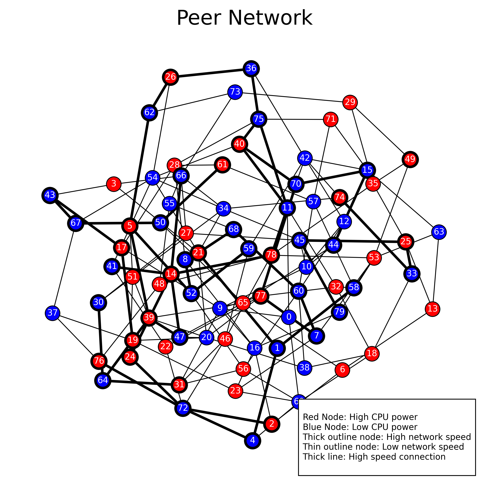
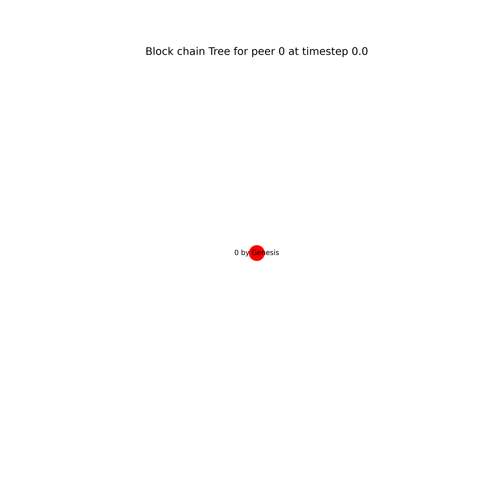
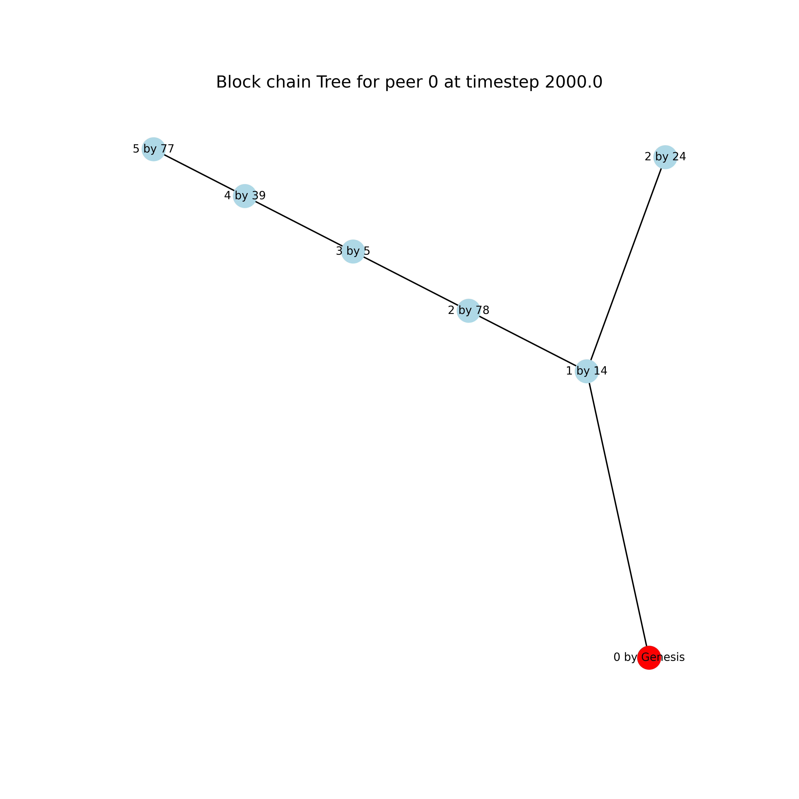
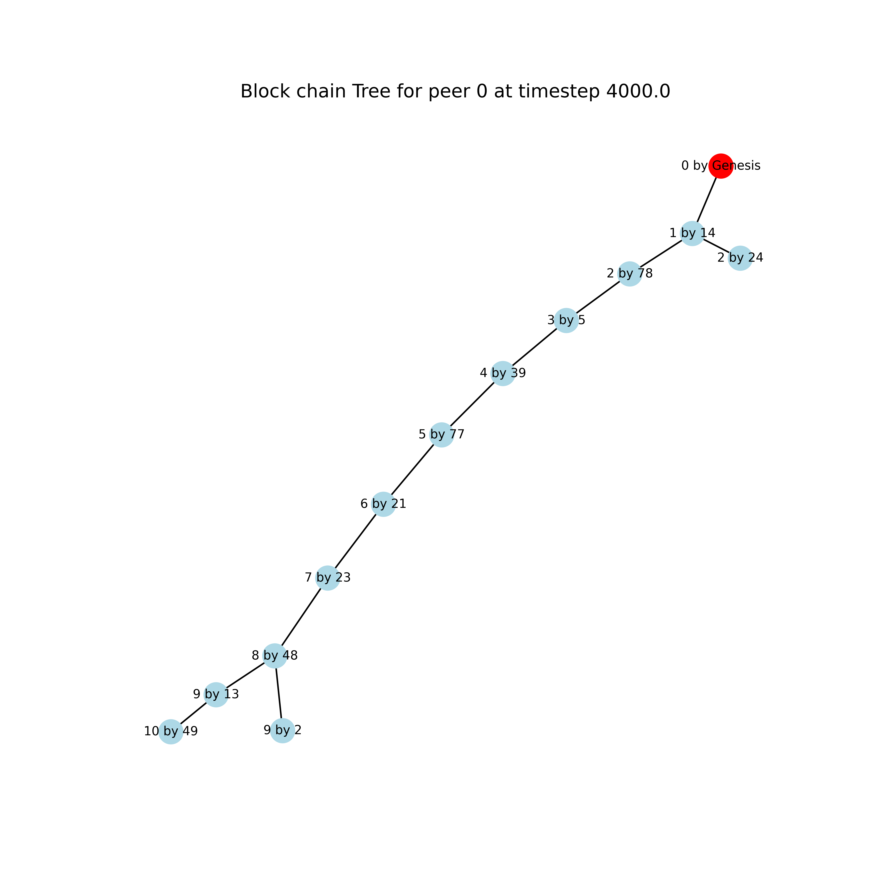
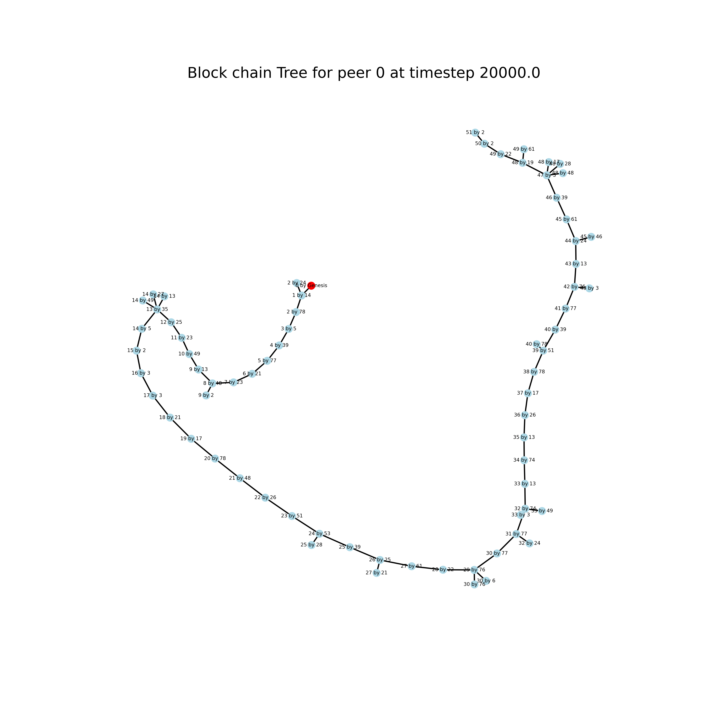
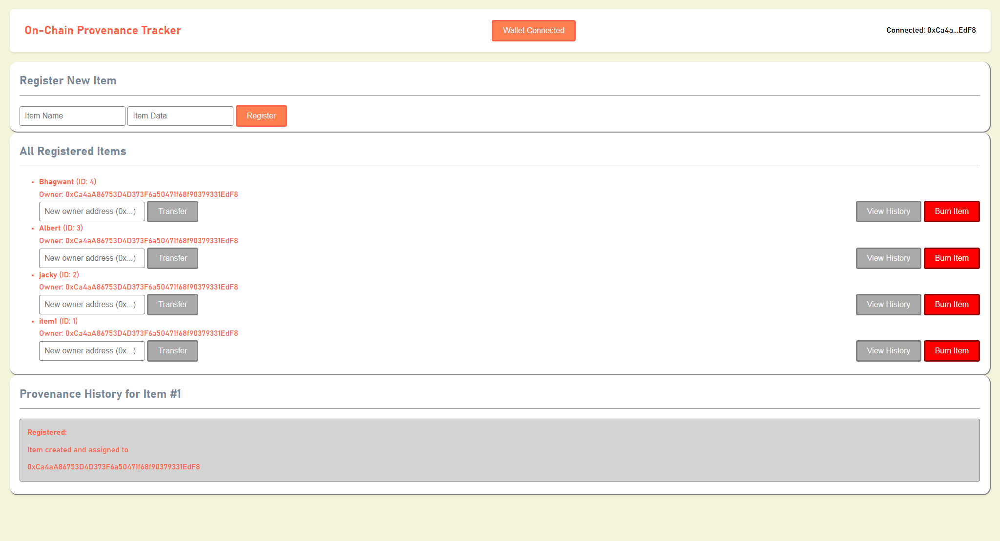

# Blockchain Arena: Simulating Mining Wars and Building DApps
### SoC 2025 Final Submission

**Name:** Aadeshveer Singh  
**Roll no:** 24B0926  
**GitHub:** Aadeshveer  

---

## Project Overview

This repository contains the complete body of work for the "Blockchain Arena: Simulating Mining Wars and Network Attacks" Summer of Code 2025 project. This project was a comprehensive exploration of blockchain technology, divided into two major parts:

1.  **Part 1: A Discrete-Event Simulator for a Proof-of-Work (PoW) P2P Network.** This from-scratch implementation in Python models the dynamics of a cryptocurrency network, including peer heterogeneity, network latencies, block propagation, mining competition, and fork resolution. The goal was to build a foundational tool to study the emergent properties of decentralized consensus.

2.  **Part 2: A Verifiable On-Chain Provenance Tracker DApp.** This full-stack decentralized application, built with Solidity and a web frontend, demonstrates practical smart contract development on the Ethereum blockchain. It creates a system for registering unique items and tracking their ownership history, similar to a Non-Fungible Token (NFT).

This document serves as a final report, detailing the design, implementation, and results for both parts of the project.

---

# Part 1: P2P Cryptocurrency Network Simulator

*(This part corresponds to Assignments 1 and 2 of the project.)*

## 1.1. Simulator Objective

The primary objective of this simulator is to model and study the fundamental dynamics of a Proof-of-Work based cryptocurrency network. By simulating key aspects like peer heterogeneity (CPU power and network speed), transaction and block propagation with realistic latencies, and competitive mining, the system allows for an in-depth analysis of emergent network behaviors such as blockchain forks, the "longest chain" rule, and overall network health under various conditions.

## 1.2. System Design and Implementation

The simulator is implemented in Python and leverages the `networkx` library for graph operations and `matplotlib` for visualization. The system is designed with a modular, object-oriented approach to manage complexity.

### Core Components:

*   **`Transaction` & `Block` (`src/simulator/chain.py`):** These classes represent the fundamental data structures. `Block` contains a creator ID, a reference to the previous block's ID, and a list of transactions. A coinbase transaction is added by the miner.
*   **`TreeNode` & `BlockTree` (`src/simulator/chain.py`):** Each peer maintains its own view of the blockchain as a tree structure (`BlockTree`). This is crucial, as different peers can have temporarily different views of the "truth." The `BlockTree` class manages adding new blocks, validating transactions against the parent block's account state, finding the current longest chain, and visualizing this tree structure.
*   **`Peer` (`src/simulator/peer.py`):** This class represents a node in the P2P network and encapsulates all individual decision-making logic. Each peer:
    *   Is initialized with attributes for ID, CPU power (LOW/HIGH), and network speed (SLOW/FAST).
    *   Maintains its own `BlockTree`, representing its local view of the blockchain.
    *   Is assigned a `hashing_fraction` based on the global distribution of CPU power.
    *   Generates new transactions periodically (based on a Poisson distribution) if it has a balance from mining rewards.
    *   **Mines new blocks (Proof-of-Work):** A peer continuously works on mining a new block on top of the tip of its current longest chain. The time to mine a block is drawn from a Poisson distribution whose mean is inversely proportional to the peer's hashing fraction (`(target_block_interval * SCALE) / hashing_fraction_of_peer`).
    *   **Switches Mining Target:** Critically, if a peer receives a new, valid block that makes a different chain longer than the one it's currently working on, it immediately abandons its current mining attempt and starts mining a new block on top of this new, longer chain. This models the core behavior of PoW consensus.
*   **`Network` (`src/simmulator/network.py`):**
    *   Initializes the P2P network topology using a custom generator that ensures a connected graph with specified peer counts (50-100) and degree constraints (3-6).
    *   Assigns peer attributes and calculates message latencies based on propagation delay, link speed (100 Mbps vs. 5 Mbps), message size, and a Poisson-distributed queuing delay.
*   **`Event` & `DiscreteEventSimulator` (`src/simulator/main.py`):**
    *   The `Event` class provides a clear structure for events.
    *   The `DiscreteEventSimulator` is the engine of the project. It manages a global simulation `time` and an event queue. In each time step, it processes events, and polls each peer to see if it has generated a new transaction or successfully mined a block. New `_SEND` events are created, which in turn schedule `_RECIEVE` events for neighbors based on calculated latencies. Upon receiving a message, a peer processes it and may generate new `_SEND` events to propagate the message further.

## 1.3. How to Run the Simulation

1.  **Prerequisites:**
    *   Python 3.x
    *   Required libraries: `numpy`, `networkx`, `matplotlib`, `scipy`
        ```bash
        pip install numpy networkx matplotlib scipy
        ```
2.  **Clone the Repository:**
    ```bash
    git clone https://github.com/Aadeshveer/Blockchain_arena_SoC_2025.git
    cd Blockchain_arena_SoC_2025
    ```
3.  **Execution:**
    The repository includes `run.ps1` (for Windows PowerShell) and `run.sh` (for Linux/macOS Bash) to automate running experiments with different parameters. To run a single simulation, use `src/main.py` from the command line:
    ```bash
    python3 src/simulator/main.py <num_peers> <slow_net_%> <low_cpu_%> <block_interval> <tx_interval> <logging(T/F)>
    ```
    **Example:**
    ```bash
    python3 src/simulator/main.py 80 50 50 60 10 F
    ```
    This command runs a simulation with 80 peers, 50% slow network, 50% low CPU, a target mean block interval of 60 seconds, a mean transaction generation interval of 10 seconds per peer, and logging turned off.

## 1.4. Observations and Results from Simulation

A series of experiments were conducted to observe the network's behavior under different conditions. A sample run is detailed below.

*   **Parameters:** 80 Peers, 50% Slow Network, 50% Low CPU, Block Interval = 10s, Transaction Interval = 1s.
*   **Simulation Duration:** 200,000 time steps.

### P2P Network Topology
The generated P2P network shows a connected graph with the specified peer heterogeneity. Node color indicates CPU power, outline thickness indicates network speed, and edge thickness indicates link capacity.


*Figure 1: Sample P2P Network Topology generated for the simulation.*

### Blockchain Tree Evolution and Forking
The visualization of Peer 0's blockchain tree over time provides clear evidence of key blockchain dynamics: initial linear growth, the natural formation of forks due to concurrent block discovery, and fork resolution via the longest chain rule, where shorter branches become orphaned.


*Figure 2.1: The initial Genesis block.*


*Figure 2.2: Early growth of the chain.*


*Figure 2.3: A fork occurs at depth 2 and 8.*


*Figure 2.4: The structure of the tree after 200,000 time steps, showing a dominant main chain and several orphaned side branches.*

### Analysis and Answers to Assignment Questions

1.  **Ratio of blocks in the longest chain to total blocks generated:** My experiments show this ratio is generally high (often >95%) but decreases as the block interval becomes shorter relative to network latency. A shorter block interval increases the chances of concurrent block discoveries, leading to more forks and more orphaned blocks that do not make it into the main chain.
2.  **Number and length of branches:** The number of forks is inversely related to the block interval. For very low intervals (e.g., 5-10s), numerous small forks of length 1 are common. Longer forks (depth > 1) are rare but can occur. As the block interval increases (e.g., 50-100s), the network has more time to reach consensus on the latest block before a new one is found, drastically reducing the number of forks.
3.  **Effect of other parameters:** A higher percentage of low-power CPU peers centralizes mining among the few high-power peers, which can paradoxically lead to fewer forks if network latency is low. High network latency (many slow peers/links) is a significant contributor to forks, as it takes longer for a newly mined block to propagate, giving other miners a larger window to find a competing block.

## 1.5. Challenges and Conclusion for Part 1

Implementing the discrete-event simulator was a significant challenge, particularly in managing event timings, debugging race conditions in block propagation, and correctly modeling the "switch-to-longest-chain" mining behavior. The project was a profound learning experience in simulation, P2P systems, and the emergent properties of PoW consensus.

---

# Part 2: Verifiable On-Chain Provenance Tracker (DApp)

*(This part corresponds to the Final Assignment of the project.)*

## 2.1. Objective and Learning Acknowledgement

The objective of this assignment was to build a full-stack decentralized application (DApp) to create a verifiable, tamper-proof record of provenance for unique items, similar to an NFT. This involved writing, testing, and deploying a Solidity smart contract and building a web frontend to interact with it.

**Learning methodology:** As a developer new to the specific tech stack of DApp development (Solidity, `ethers.js`, frontend integration) and facing a tight deadline, I utilized AI-powered tools to generate a baseline for the frontend code. The process was not one of copy-pasting; rather, the generated code served as a scaffold which I then studied, debugged, modified, and "humanized" to ensure I understood every component. The true learning came from this process of deconstructing, understanding, and validating the standard patterns for DApp interaction, such as connecting to MetaMask, querying contract events, and sending transactions.

## 2.2. DApp Components
*Present in `src/dapp`*

### Smart Contract (`Tracker.sol`)
A Solidity smart contract was written to serve as the backend logic.
*   **`Item` Struct:** Stores an item's unique `id`, `name`, current `owner` address, and additional `data` (for enhanced metadata).
*   **State Management:** Uses a `mapping` to link IDs to `Item` structs and a counter for new item IDs.
*   **Functions:**
    *   `registerItem(name, data)`: Creates a new item, assigning the caller (`msg.sender`) as the initial owner.
    *   `transferOwnership(id, newOwner)`: Allows the current owner of an item to transfer it to a new address.
    *   `burnItem(id)`: A bonus feature allowing the owner to permanently delete an item's record.
*   **Events:** Emits `ItemRegistered`, `OwnershipTransferred`, and `ItemBurnt` events. These are indexed to allow for efficient querying by the frontend.
*   **Security:** Functions include `require` statements to enforce access control (e.g., only the owner can transfer or burn an item).

### Frontend (`index.html`, `style.css`, `script.js`)
A web interface was built to interact with the deployed smart contract. Which can be seen in figure 3.
*   **Technology:** Simple HTML and CSS for structure and styling, with JavaScript and the `ethers.js` library for blockchain interaction.
*   **Features:**
    1.  **Wallet Connection:** A button allows users to connect their MetaMask wallet.
    2.  **Item Registration:** A form to call the `registerItem` function.
    3.  **Item Display:** Fetches and displays all registered items by querying past `ItemRegistered` events from the blockchain.
    4.  **Ownership Transfer:** An interface for the current owner of an item to transfer it to a new address.
    5.  **Provenance Viewing:** A feature to view the complete ownership history of any item by fetching and displaying all `OwnershipTransferred` and `ItemRegistered` events associated with its ID.
    6.  **Burning:** A button for the owner to burn their item.


*Figure 3: A screenshot of Dapp*

## 2.3. How to Use the DApp

1.  **Prerequisites:**
    *   A web browser with the [MetaMask](https://metamask.io/) extension installed.
    *   Connected to the **Sepolia Test Network** in MetaMask.
    *   Some Sepolia test ETH (available from a public faucet).
2.  **Running the Frontend:**
    *   Clone the repository.
    *   Open the `src/dapp/index.html` file in your web browser, using a local server.
3.  **Interact with the Deployed Contract:**
    *   **Deployed Contract Address (Sepolia):** `0x3E364004145956Dac1760c5A15FE78fb8E3f6872`
    *   **Contract on Etherscan:** `https://sepolia.etherscan.io/address/0x3E364004145956Dac1760c5A15FE78fb8E3f6872`

## 2.4. Conclusion for Part 2

This DApp project was a valuable practical exercise in smart contract development and full-stack integration. It provided hands-on experience with Solidity, `ethers.js`, and the event-driven architecture of decentralized applications. While AI tools were used to accelerate the initial frontend development, the process of debugging and understanding the code provided a solid foundation in DApp principles.
